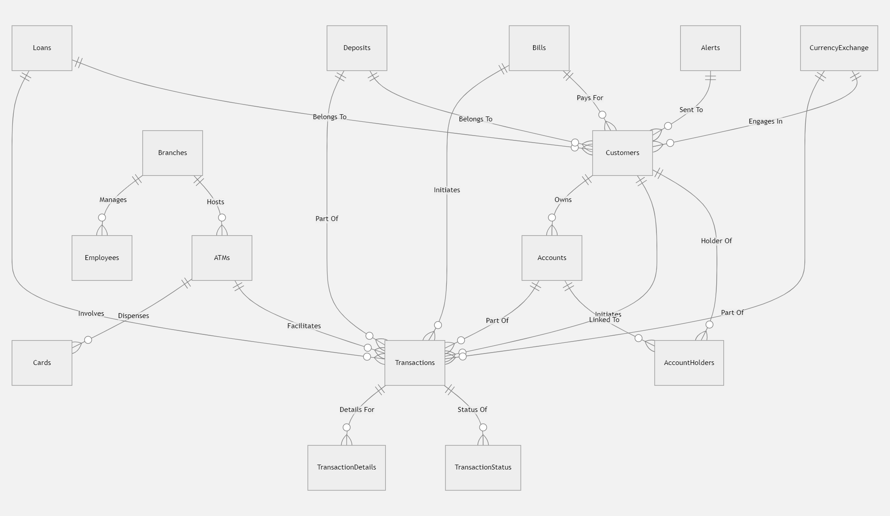
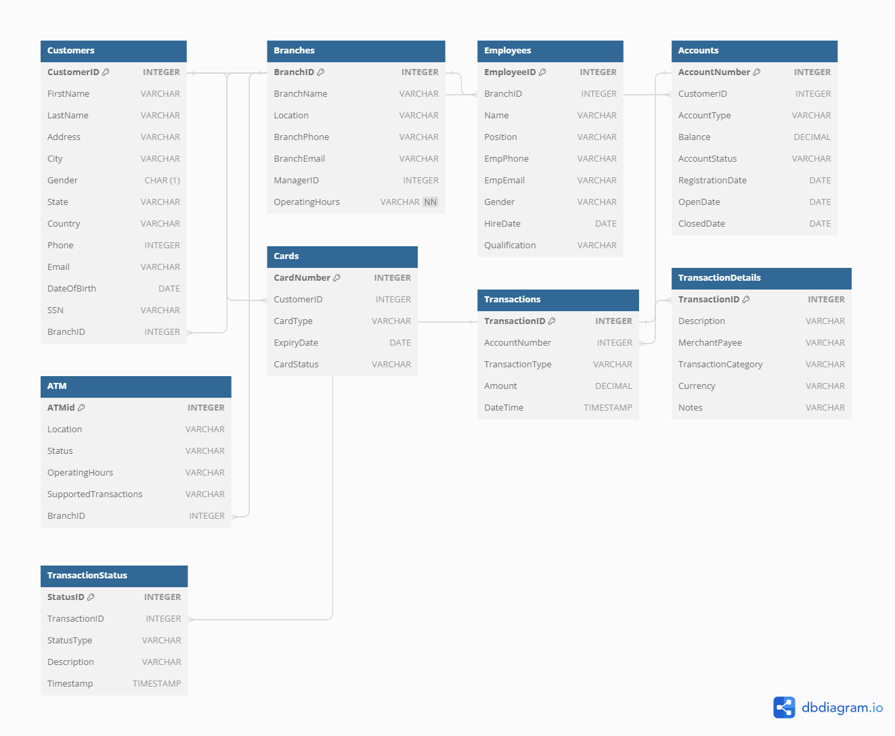

# Banking Database Design Using PostgreSQL and pgAdmin


**Introduction:**
This project focuses on designing a robust and efficient banking database system using PostgreSQL and pgAdmin. The primary goal is to optimize transaction management, ensuring both data integrity and performance.

**Case Study Overview:**
The client, a leading financial institution, aimed for a comprehensive overhaul of their existing banking transactions database. The objectives included enhancing system performance, ensuring data integrity, and efficiently managing the increasing transaction volume.

### Key Components of the Project:

**Understanding the Requirements:**
- Identified key requirements, prioritizing and strategically organizing them.
- Comprehensively explained client requirements for the new database design.

**Data Modeling:**
- Executed a thorough data modeling process for the banking transactions database.
- Implemented effective normalization strategies to minimize data redundancy.

**Database Architecture:**
- Chose PostgreSQL as the database, leveraging its relational capabilities.
- Addressed scalability and performance concerns within the selected architecture.

**Transaction Management:**
- Developed strategies to manage transactions, ensuring consistency and reliability.
- Implemented mechanisms to handle concurrent transactions and prevent data anomalies.

**Security and Compliance:**
- Addressed security concerns with data encryption, access control, and compliance measures.
- Implemented safeguards to protect sensitive customer information within the database.

**Performance Optimization:**
- Employed strategies to optimize the performance of the banking transactions database.
- Implemented caching mechanisms, indexing strategies, and other techniques for enhanced query performance.

## Database Design Process

**Phase I: Requirements Collection and Analysis**
- Interviewed and consulted with database users to understand data requirements.
- Identified key entities and relationships, laying the foundation for the conceptual design.

**Phase II: Conceptual Design**
- Formulated a comprehensive E-R diagram representing the identified entities and relationships.


**Phase III: Logical Design (Data model mapping)**
- Translated the conceptual design into a logical database schema.
- Specified entities, relationships, attributes, primary keys, and foreign keys.
- [Database Schema Documentation](https://dbdocs.io/akweiwonder3/BankDB)



**Phase IV: Physical Design (Internal Schema)**
- Transformed the logical database schema into a physical database.
- Created tables, specified columns, defined data types, and implemented constraints and keys.

**Phase V: Usage and Setup**
- Employed Docker and Docker Compose for a standardized environment.
- Offered detailed setup instructions in the readme, including links to online documentation and ERD images.

## Tools Used
- **PostgreSQL:** Main database management system.
- **PgAdmin:** Administration and management tool for PostgreSQL.
- **Docker:** Containerization platform for creating a consistent and isolated environment.
- **mermaid.io, draw.io, dbdocs.io, dbdiagram.io:** Tools for visualizing and documenting the database design.

## Setup

1. Clone this repository.
2. Navigate to the project directory.
   ```
   cd Banking-Database-Design-using-PostgreSQL-and-pgAdmin
   ```
3. Update the .env file with your PostgreSQL and PgAdmin credentials.
   ```
   POSTGRES_DB=
   POSTGRES_USER=
   POSTGRES_PASSWORD=
   
   PGADMIN_DEFAULT_EMAIL=
   PGADMIN_DEFAULT_PASSWORD=
   ```
4. Run the following command to build and start the PostgreSQL container:
   ```
   docker-compose up -d
   ```
5. Connect to the PostgreSQL database using PgAdmin with the provided credentials.
   - Host: localhost
   - Port: 5432
   - Database: BankDB
   - User: admin
   - Password: admin
